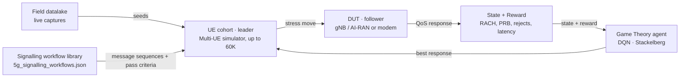

# Anritsu AI-RAN Test Arena — Product Requirements Document

*v1.2 · 2 Nov 2026 · Marsh Dsouza*

> **Change log**
> - **v1.2 (2 Nov 2026):** Games are now driven by the **5G signalling workflow library** (`5g_signalling_workflows.json`, 12 workflows, 3GPP-baselined). Every ladder branch and stress move traces to a workflow ID. Added Level 5 (IMS Voice & Video), new feature M11, workflow mapping (§3), three-cell emulation, and new success criteria and open questions.
> - **v1.1 (2 Nov 2026):** Added the **Procedure Ladder**, four game-theory levels for core mobile procedures (Registration → Data Call → Handover → Throughput). New features M10, S8 and N8; new game catalogue (§3); new success criteria and open questions (§6).
> - **v1.0 (29 Oct 2026):** First release.

## 1. Vision

Test Arena turns AI-RAN and modem testing into an endless, adversarial game. An AI-trained UE cohort plays against the device under test (DUT) until the DUT breaks or the engineer calls time.

**The problem.** Today's protocol and RF test suites are scripted, static and written by hand. They prove conformance but rarely find the edge cases a live 6G network will throw at a gNB or modem: signalling storms, retry loops, and mixed URLLC/eMBB/mMTC contention. Field data that could reveal those cases sits unused in the datalake.

**The product.** Test Arena is a web application that sits on top of Anritsu's Multi-UE simulator (up to 60K UEs). An engineer picks a feature and a difficulty level, and the platform generates testcases from live field captures and launches them as a "game". A Game Theory agent (DQN, Stackelberg leader–follower) learns which sequences push the DUT hardest, scores the DUT's QoS response, and escalates.

**Two ways to play.**

| Mode | What it is | Ends when |
| --- | --- | --- |
| **Stress games** | Four endless load games (Signalling Storm, Retry Loop, Small-Packet Flood, GBR Squeeze). The agent escalates until something breaks. | User Stop or DUT failure |
| **Procedure Ladder** *(v1.1, extended in v1.2)* | Five levels that test the core mobile procedures in the order a UE uses them: **Registration → Data Call → Handover & Mobility → Throughput → IMS Voice & Video**. Each level is modelled as a different kind of game, and a level unlocks only when the one before it is cleared. | Level clear, User Stop or DUT failure |

The ladder is the "basics first" path. A DUT that can't register correctly has no business being stress-tested, so engineers (and new users learning the tool) start at Level 1 and climb.

**Built on real signalling.** Moves are not invented. Each one replays a 3GPP signalling workflow from the **workflow library** (`5g_signalling_workflows.json`): the message sequence, the information elements, the timers and the expected UE behaviour, baselined on TS 38.508-1, 38.331, 24.501, 24.229 and 38.523-1. The game decides *which* workflow, failure case or reject cause to play next; the workflow decides *exactly what goes on the air* and what "correct" looks like. See §3, Signalling workflow library.

**The game loop.**

1. **Leader (UE cohort)** chooses an attack move: RACH burst, access-retry loop, small-packet flood, or GBR throughput demand. On the ladder, moves are the level's branch set (§3, Procedure Ladder catalogue). Every move is a workflow from the library (or a failure case, variant or reject cause within one), replayed across the cohort.
2. **Follower (DUT)** responds with barring, admission, scheduling or rejects.
3. **State** (RACH, PRB use, rejects) and **Reward** (reject, latency, drop) feed the agent.
4. **Agent** computes its best response and escalates. Stress games never end on their own; ladder levels end when the level is cleared.

```mermaid
flowchart LR
    DL[Field datalake<br/>live captures] -- seeds --> L[UE cohort · leader<br/>Multi-UE simulator, up to 60K]
    WF[Signalling workflow library<br/>5g_signalling_workflows.json] -- message sequences + pass criteria --> L
    L -- stress move --> D[DUT · follower<br/>gNB / AI-RAN or modem]
    D -- QoS response --> SR[State + Reward<br/>RACH, PRB, rejects, latency]
    SR -- state + reward --> A[Game Theory agent<br/>DQN · Stackelberg]
    A -- best response --> L
```

Field captures seed the cohort and the workflow library supplies the moves. Every DUT response becomes the agent's next state and reward, so a stress game only ends on Stop or failure.

**Why it matters.** Anritsu moves from selling test equipment to selling *discovered failure modes*. R&D teams find breaking points in days rather than in field trials. Every run makes the agent and the testcase library smarter.

**One-line pitch:** *Don't write tests. Play the network until it breaks.*

## 2. User Personas

Three people use Test Arena daily. Priya is the primary design target.

### Priya — gNB / AI-RAN Protocol Test Engineer (primary)

- **Works at:** a Tier-1 RAN vendor's 6G lab, where she owns L2/L3 and RRM verification for an AI-RAN scheduler.
- **Goal:** find where the AI scheduler breaks under mixed URLLC/eMBB/mMTC load, before the operator does.
- **Pain today:** she spends 60% of her week writing and maintaining TTCN/Python scripts that only test what she already thought of.
- **Needs from Test Arena:** to pick "RACH storm, Hard", hit Play and leave it running overnight, then come back to a ranked list of failures with full logs. On a new software drop she first runs the Procedure Ladder to confirm the basics still hold.
- **Success for her:** "It found a bug I would never have scripted."

### Kenji — Modem Firmware & RF Engineer

- **Works at:** a chipset/modem maker, validating 5G-Advanced/6G modem firmware on the RF and protocol side.
- **Goal:** stress the modem's protocol stack and RF front-end against realistic, hostile network behaviour.
- **Pain today:** network emulator scenarios are idealised, and real-network quirks only appear in expensive drive tests.
- **Needs from Test Arena:** to flip the game so the *network* becomes the adversary, replaying field-captured operator behaviour (e.g. a specific MNO's configuration) against his modem. The ladder's off-path branches (reject causes, timer expiry, RRC reject, handover failure, IMS SIP errors) are exactly the cases his scripts miss, and each one traces to a 3GPP workflow and clause he already knows.
- **Success for him:** reproducing a field-reported crash in the lab within an hour.

### Sofia — Test Automation Lead / Programme Manager

- **Works at:** a mobile operator's or vendor's integration lab, where she runs a team of 8 engineers and the CI pipeline.
- **Goal:** hyper-automated, lights-out regression with clear evidence for release go/no-go decisions.
- **Pain today:** test results live in scattered logs, and no single score shows whether a software drop is stronger or weaker than the last.
- **Needs from Test Arena:** API/CI triggers, a leaderboard of DUT builds by resilience score, and exportable reports for management. "Highest ladder level cleared" is a simple first gate for every build.
- **Success for her:** every nightly build gets a resilience score with no human in the loop.

## 3. Feature List

The scope assumes one developer working with AI coding agents. The Must-Haves form a demoable MVP in roughly 14–16 weeks (v1.0 estimate plus ~2 weeks for the Procedure Ladder and ~2 weeks for the workflow library and Level 5). Hardware integration starts as a simulated adapter, so the UI and game engine never wait on lab access.

### Must-Have (MVP)

| # | Feature | What it does | Maps to |
| --- | --- | --- | --- |
| M1 | Game Lobby | Pick mode (Stress games or Procedure Ladder), target (gNB or modem), feature or ladder level, and difficulty (Easy / Normal / Hard / Brutal). | Vibe 1 |
| M2 | Testcase generator | Builds a testcase sequence from datalake field captures filtered by feature and difficulty, and shows the source captures used. For ladder levels it also lists the branch set and game model. | Vibe 1, live data |
| M3 | Endless game loop | Runs continuously and stops only on user Stop or a defined DUT failure (crash, KPI breach, assert). Ladder levels also end on Level Clear. | Vibe 2 |
| M4 | Game Theory engine v1 | Stackelberg leader–follower loop with a DQN agent choosing the next stress move from state + reward. On the ladder the agent chooses which branch to play next. | Vibe 6 |
| M5 | Built-in stress games (4) | Signalling Storm, Retry Loop, Small-Packet Flood, GBR Squeeze, each a preset game with tunable intensity. Each move scales up a library workflow (see the stress-game mapping in §3). | Vibe 6 |
| M6 | Live arena view | Cohort grid (URLLC / eMBB / mMTC), DUT status, State → Reward → Action panel, live QoS score. | Vibe 1 |
| M7 | Built-in diagnostics | Live KPI strip (five KPIs per game; see catalogue). On failure, auto-captures the last N seconds of logs + game state. | Vibe 3 |
| M8 | Instrument adapter layer | One interface to the Multi-UE simulator; ships with a mock adapter for development and demos. | Platform |
| M9 | Run history | Every game saved with config, score timeline, failure point and replay of the move sequence. | Diagnostics |
| M10 | **Procedure Ladder (5 levels)** | Registration → Data Call → Handover & Mobility → Throughput → IMS Voice & Video. Each level has its own game model, branch set, five KPIs and clear rule. Levels unlock in order per DUT. | Vibe 1, Vibe 6 |
| M11 | **Signalling workflow library** | Loads `5g_signalling_workflows.json` (schema `test-arena.signalling-workflows` v1.0.0). Every ladder branch and stress move references a workflow ID (plus failure case, variant or cause). The Briefing shows each branch's message flow; the Arena narrates messages and timers as they play; reports name the workflow step where the DUT went wrong. | Vibe 1, Vibe 3 |

### Should-Have (v1.1)

| # | Feature | What it does | Maps to |
| --- | --- | --- | --- |
| S1 | Hot-add games | While a game runs, prompts the user to stack another feature ("DUT survived 30 min — add Mobility Storm?"). Games run concurrently. | Vibe 2 |
| S2 | Vendor & operator profiles | Import RAN vendor parameter sets and MNO network models (JSON/YAML). The agent adapts its strategy per profile. | Vibe 5 |
| S3 | Automation API + CI hooks | REST/WebSocket API to start, stop and query games; webhooks on failure; Jenkins/GitLab examples. | Vibe 4 |
| S4 | Failure root-cause hints | AI summary of the failure: the move sequence that triggered it, the KPIs that drifted first, and the likely layer. | Vibe 3 |
| S5 | Reverse mode (modem) | The network becomes the adversary for modem testing, replaying operator behaviour against the modem. | Persona Kenji |
| S6 | Resilience leaderboard | Ranks DUT builds by resilience score and highest ladder level cleared, and shows the trend across software drops. | Persona Sofia |
| S7 | Scheduled campaigns | Queue games overnight with a stop budget (time, failures). | Vibe 4 |
| S8 | **Tournament mode** | Chains all five ladder levels in one run with state carried across (registered UE → active PDU session → handover with data running → throughput after handover → VoNR call over the same bearers). Workflow cross-references such as WF-09g (RLF during an active call, see WF-12) are played here. Finds interaction bugs that pass in isolated levels. | Vibe 2 |

### Nice-to-Have (later)

| # | Feature | What it does |
| --- | --- | --- |
| N1 | Game designer | No-code editor to compose new stress games from move primitives. |
| N2 | Agent library | Swap algorithms (PPO, multi-agent, Nash equilibrium search) and compare which breaks the DUT fastest. |
| N3 | Testcase export | Export winning attack sequences as reusable conformance-style scripts. |
| N4 | Achievements & streaks | Badges such as "First Blood" (first DUT failure), "Iron DUT" (24 h with no failure) and "Ladder Master" (all five levels cleared on Brutal). |
| N5 | Digital Twin hook | Run games against a network digital twin before touching real hardware. |
| N6 | Multi-user arena | Shared live view, comments on failure moments, team spectator mode. |
| N7 | NTN / RF impairment games | Doppler, delay and fading stress for non-terrestrial and RF front-end testing. |
| N8 | **Mobility under load** (Ladder Level 6) | A repeated game where handovers happen during congestion, so the Level 3 and Level 4 rules must hold at the same time. |
| N9 | **Workflow authoring and import** | Add or edit workflows in the library schema, and import them from existing TTCN-3 / TS 38.523-1 test cases, so customers can bring their own procedures into the game. |

### Signalling workflow library

The library file `5g_signalling_workflows.json` is the single source of truth for what every move sends and what counts as correct.

- **Schema:** `test-arena.signalling-workflows` v1.0.0 · technology 5G NR SA (5GS) · generated 2 Nov 2026.
- **Spec baseline:** default message contents per TS 38.508-1 (clauses 4.5–4.7, 6); RRC TS 38.331; NAS TS 24.501; IMS TS 24.229 with conformance defaults TS 34.229-1/-5; conformance procedures TS 38.523-1; UE test mode TS 38.509.
- **Test environment defaults:** PLMN 001/01; NR Cell 1 (serving, TAC 000001), NR Cell 2 (intra-frequency neighbour, same TA), NR Cell 3 (neighbour in TAC 000002, for mobility registration); S-NSSAI SST 1; SIB1 timers (T300, T301, T310, N310, T311, N311, T319).
- **Step model:** each step has `seq`, `dir` (UL, DL, UE-internal, SS action), `layer` (RRC, 5GMM, 5GSM, SIP, SDP, RTP, UP, PHY, MAC), `channel`, `message`, `container`, `ies`, `ref` (into the defaults), `expect`, `optional` and `timers` (started/stopped).
- **Outcome model:** success workflows have `passCriteria`; failure workflows add `causeMatrix`, `failureCases` and `variants`, each with the expected UE behaviour.
- **Verification flags:** 29 fields are marked `verify: true` (typical 38.508-1 defaults that change between releases or depend on PIXIT/ICS). They must be checked against the 38.508-1 version the customer's suite is baselined on.

#### The 12 workflows and where they play

| ID | Workflow | Category | Plays in |
| --- | --- | --- | --- |
| WF-01 | MO Data Call | data · success | L2 baseline; stress games (RRC setup, service request) |
| WF-02 | MT Data Call (paging) | data · success | L2; Signalling Storm (paging flood) |
| WF-03 | IMS Voice Call (VoNR, MO) | ims-voice · success | L5 baseline; GBR Squeeze (5QI 1 dedicated flow) |
| WF-04 | IMS Video Call (ViNR, MO), extends WF-03 | ims-video · success | L5 |
| WF-05 | Intra-frequency handover (+ b inter-frequency, c new TA) | mobility-connected · success | L3 baseline |
| WF-06 | Cell reselection in RRC_IDLE (+ b new TA, c priority-based) | mobility-idle · success | L3 |
| WF-07 | Registration failure (10-entry cause matrix, + b auth failure, c NAS SMC reject) | failure-registration | L1 |
| WF-08 | MO data call failure (cases a–e, SERVICE REJECT cause matrix) | failure-data | L2; Retry Loop |
| WF-09 | IMS voice call failure (cases a–h) | failure-ims-voice | L5 |
| WF-10 | IMS video call failure (cases a–f) | failure-ims-video | L5 |
| WF-11 | Handover failure, T304 expiry (+ b–d) | failure-mobility | L3 |
| WF-12 | Radio link failure (+ b–e) | failure-radio | L3; cross-referenced by WF-09g |

#### How a workflow becomes a move

1. **Pick.** The agent picks a branch, which names a workflow and optionally a failure case, variant or cause (for example `WF-07 · #22`).
2. **Replay.** The adapter replays the workflow's steps in order. `SS` steps (cell power changes, withheld responses, injected errors) are the tester's attack: that is where the game deviates from the happy path.
3. **Fan out.** Workflows describe one UE. The cohort plays the same branch across many UEs with staggered start times, so per-UE outcomes become the level's KPIs (success %, latency, rejects, timeouts).
4. **Judge.** The branch passes only if the DUT meets the workflow's `passCriteria` or the matching `expectedUE` (correct message, cause, timer start/stop, state). A wrong message, a missed timer or a hang is a branch failure; a crash or KPI breach is `DUT DOWN`.
5. **Record.** The run log keeps the workflow ID, case and the step reached, so a failure report reads "Failed at WF-11 step 4: no RRCReestablishmentRequest before T311 expiry".

#### Stress games and their workflow basis

| Stress game | Workflow basis | What is scaled up |
| --- | --- | --- |
| Signalling Storm | WF-01 steps 1–4, WF-02 step 1 | RRCSetupRequest / SERVICE REQUEST bursts and paging floods |
| Retry Loop | WF-08a, WF-08b, WF-07 (#22 + T3346) | UEs that ignore RRCReject wait time, T300 expiry and T3346 back-off |
| Small-Packet Flood | WF-01 steps 1–12 | Short service-request-plus-data cycles from mMTC UEs |
| GBR Squeeze | WF-03 steps 12–15 | Dedicated 5QI 1 QoS flows via PDU SESSION MODIFICATION until admission runs out |

### Procedure Ladder — game catalogue

Every level is a two-player game: the **Tester** (agent + UE cohort) tries to make the DUT misbehave, and the **DUT** wins a branch only if it behaves as the workflow says it should. Each level uses a different game-theory model, which decides how the agent explores.

| Level | Procedure | Game model | Workflows | What the model tells the tester |
| --- | --- | --- | --- | --- |
| 1 | Registration ("The Handshake") | **Sequential (extensive-form) game**, solved by backward induction | WF-07 | The DUT must be correct at *every* node of the procedure tree, including off-path branches (subgame perfection). The happy path alone proves little. |
| 2 | Data Call ("The Agreement") | **Coordination game** | WF-01, WF-02, WF-08 | UE and network must agree to bring up service. Test the miscoordination cells (reject, no response, partial accept), not just the agreed one. |
| 3 | Handover & Mobility ("Leader and Follower") | **Stackelberg game** | WF-05, WF-06, WF-11, WF-12 | The network leads by setting measurement and trigger parameters; the UE follows. The tester plays a "bad leader" and breaks the handover to test recovery. |
| 4 | Throughput ("Sharing the Pie") | **Congestion game + Nash bargaining**; link adaptation as a game against Nature | WF-01 (bearer set-up only) | Users compete for PRBs. Proportional-fair scheduling corresponds to the Nash Bargaining Solution, so fairness and efficiency are both measured. |
| 5 | IMS Voice & Video ("The Negotiation") | **Alternating-offers bargaining** (Rubinstein) | WF-03, WF-04, WF-09, WF-10 | SIP/SDP offer–answer and QoS preconditions are a sequence of offers and counter-offers. The tester rejects, counters or stalls to see whether the DUT settles, falls back or releases resources cleanly. |

Branch tables list the order the branches are played in; the first row is always the baseline. Easy plays the first four rows.

#### Level 1 — Registration

- **Procedure tree:** RRC setup → REGISTRATION REQUEST (T3510 started) → Authentication → NAS Security Mode → REGISTRATION ACCEPT or REJECT (T3510 stopped) → RRCRelease. Source: WF-07 steps 1–6; TS 24.501 5.5.1.2.5; TS 38.523-1 9.1.5.

| # | Branch | Workflow | Correct DUT behaviour (from the library) |
| --- | --- | --- | --- |
| 1 | Initial registration accepted (baseline) | WF-07 steps 1–4 + ACCEPT *(no success workflow yet, see open questions)* | Registration completes within the latency target |
| 2 | REJECT #3 Illegal UE | WF-07 cause matrix | USIM invalid for 5GS; delete 5G-GUTI, TAI list, ngKSI; no further attempts until power cycle |
| 3 | REJECT #7 5GS services not allowed | WF-07 cause matrix | USIM invalid for 5GS services; 5GMM-DEREGISTERED.NO-SUPI |
| 4 | REJECT #11 PLMN not allowed | WF-07 cause matrix | Add PLMN to the forbidden list; perform PLMN selection |
| 5 | REJECT #12 Tracking area not allowed | WF-07 cause matrix | Add TAI to forbidden TAs for regional service; LIMITED-SERVICE |
| 6 | REJECT #13 Roaming not allowed in this TA | WF-07 cause matrix | Add TAI to forbidden TAs for roaming; PLMN selection |
| 7 | REJECT #15 No suitable cells in TA | WF-07 cause matrix | Add TAI to forbidden roaming list; search another TA |
| 8 | REJECT #22 Congestion + T3346 | WF-07 cause matrix | Start T3346; no new registration until it expires |
| 9 | REJECT #27 N1 mode not allowed | WF-07 cause matrix | Disable N1 mode for 3GPP access |
| 10 | REJECT #62 No network slices available | WF-07 cause matrix | Store rejected NSSAI; no retry with the same NSSAI |
| 11 | No response (T3510 × 5 → T3502) | WF-07 cause matrix | Retry on T3510 expiry; after 5 attempts start T3502 |
| 12 | Authentication MAC failure (#20) | WF-07b | AUTHENTICATION FAILURE cause #20 |
| 13 | Authentication synch failure (#21 + AUTS) | WF-07b | AUTHENTICATION FAILURE cause #21 with AUTS |
| 14 | NAS SMC rejected (#23) | WF-07c | SECURITY MODE REJECT cause #23 on mismatched replayed capabilities |

- **KPIs (5):** Registration success (%), Registration latency (ms), Retries (/s), Rejects (/s), Procedure timeouts (/s).

#### Level 2 — Data Call

- **Procedure:** service request from 5GMM-REGISTERED/RRC_IDLE to an active user plane on PDU session 1 (QFI 1). Source: WF-01, WF-02, WF-08; TS 24.501 5.6.1, TS 38.331 5.3.3.
- **Prerequisite:** Level 1 cleared for this DUT.

| # | Branch | Workflow | Correct DUT behaviour |
| --- | --- | --- | --- |
| 1 | MO data call (baseline) | WF-01 | RRC cause mo-Data; service accepted, T3517 stopped; DRB1 carries data on QFI 1 |
| 2 | MT data call via paging | WF-02 | Responds to paging with mt-Access; service type "mobile terminated services"; DL data received |
| 3 | RRC connection rejected (wait time + T302) | WF-08a | No new mo-Data RRCSetupRequest until T302 expires |
| 4 | RRC setup no response (T300 expiry) | WF-08b | Service request aborted; NAS informed; retry per upper layers |
| 5 | SERVICE REJECT #9 / #10 | WF-08c cause matrix | Deregister, delete 5G-GUTI as required, initial registration |
| 6 | SERVICE REJECT #22 + T3346 | WF-08c cause matrix | Start T3346; no service request until expiry |
| 7 | SERVICE REJECT #28 / #7 | WF-08c cause matrix | Restricted area: NON-ALLOWED-SERVICE and mobility registration; #7: USIM invalid for 5GS |
| 8 | Service request no response (T3517) | WF-08d | Abort after T3517 (15 s); release NAS connection locally; back to 5GMM-REGISTERED |
| 9 | PDU session reactivation failure (#92) | WF-08e | No user data on PSI 1; retry later |

- **Parked (no workflow yet):** the v1.1 PDU-session negotiation branches (IPv4v6 → IPv4 only, unknown DNN, non-subscribed S-NSSAI, SSC mode, 5QI downgrade, network release) return once matching 5GSM workflows are added to the library.
- **KPIs (5):** Session setup success (%), Setup latency (ms), Fallbacks (/s), Session rejects (/s), Session drops (/s).

#### Level 3 — Handover & Mobility

- **Leader parameters:** the A3 measurement config from the library defaults (`MeasConfig_A3`: a3-Offset 3 dB, hysteresis 0, TTT 0 ms, all `verify`). The tester re-tunes them to play a "bad leader".
- **Prerequisite:** Level 2 cleared. Needs three emulated cells: Cells 1 and 2 in TAC 000001, Cell 3 in TAC 000002.

| # | Branch | Workflow | Correct DUT behaviour |
| --- | --- | --- | --- |
| 1 | Intra-frequency handover (baseline) | WF-05 | MeasurementReport on A3; RA on target and RRCReconfigurationComplete before T304; PDCP continuity |
| 2 | Too-early trigger (bad leader: low offset) | WF-05 + A3 re-tune | Hands over without a drop or immediate return |
| 3 | Too-late trigger (bad leader: high offset, long TTT) | WF-05 + A3 re-tune | Recovers before RLF, or re-establishes per WF-12 |
| 4 | Ping-pong (bad leader: zero hysteresis, short TTT) | WF-05 + A3 re-tune | Avoids bouncing between Cell 1 and Cell 2 |
| 5 | Inter-frequency handover | WF-05b | Measures target ARFCN with gaps if needed; hands over |
| 6 | Handover into a new TA | WF-05c | Hands over to Cell 3, then mobility registration updating |
| 7 | Idle-mode reselection | WF-06 | Reselects to Cell 2 and answers paging there |
| 8 | Reselection into a new TA | WF-06b | Mobility registration updating with new TAI list |
| 9 | Priority-based inter-frequency reselection | WF-06c | Follows SIB4 priorities and thresholds |
| 10 | Handover failure (T304 expiry) | WF-11 | Reverts config, T311, RRCReestablishmentRequest with cause handoverFailure |
| 11 | Re-establishment answered with RRCSetup | WF-11b | Releases old config, continues with RRCSetupComplete |
| 12 | No suitable cell during T311 | WF-11c | Goes to RRC_IDLE and informs NAS |
| 13 | Invalid reconfigurationWithSync | WF-11d | Re-establishes with cause reconfigurationFailure |
| 14 | Radio link failure (T310 expiry) | WF-12 | Declares RLF at T310 expiry, re-establishes with otherFailure, RLF report correct |
| 15 | RLF from RLC max retransmissions | WF-12b | rlf-Cause rlc-MaxNumRetx |
| 16 | RLF from random access problem | WF-12c | rlf-Cause randomAccessProblem |
| 17 | Beam failure recovery (pre-RLF) | WF-12d | Recovers via CFRA/CBRA with no RLF |
| 18 | No recovery after RLF | WF-12e | RRC_IDLE; SERVICE REQUEST on return |

- **KPIs (5):** HO success (%), Interruption time (ms), Ping-pong rate (%), RLF (/min), Session drops (/s).

#### Level 4 — Throughput

- **Bearer set-up:** WF-01 brings up DRB1 on QFI 1 before each branch. The library has no throughput workflows yet, so the branches below remain tester-defined.
- **Prerequisite:** Level 3 cleared.

| # | Branch | Correct DUT behaviour |
| --- | --- | --- |
| 1 | Single-UE peak (baseline) | Reaches peak throughput for one UE |
| 2 | Load ramp | Holds cell throughput as UEs are added |
| 3 | Mixed GBR priority | Serves GBR users without starving the rest |
| 4 | High-CQI hog | Keeps fairness when one strong UE pushes |
| 5 | Channel fade (Nature) | Picks the right MCS as SINR drops |

- **KPIs (5):** Cell throughput (Mbps), Per-UE throughput p5 (Mbps), Fairness (Jain's index, 0–1), BLER (%), PRB utilisation (%).

#### Level 5 — IMS Voice & Video *(new in v1.2)*

- **Procedure:** VoNR/ViNR MO call over IMS PDU session 2 (DNN ims, 5QI 5): service request, SIP INVITE, network-requested PDU SESSION MODIFICATION for dedicated QoS flows (5QI 1 voice, 5QI 2 video), 183/PRACK/UPDATE preconditions, 180/200/ACK, media, BYE and release. Source: WF-03, WF-04, WF-09, WF-10; TS 24.229, TS 34.229-1/-5, TS 26.114, TS 24.501 6.3.2.
- **Preconditions:** REGISTRATION ACCEPT indicates IMS VoPS = 1; IMS PDU session established; UE IMS-registered.
- **Prerequisite:** Level 4 cleared.

| # | Branch | Workflow | Correct DUT behaviour |
| --- | --- | --- | --- |
| 1 | VoNR MO call (baseline) | WF-03 | RRC cause mo-VoiceCall; 5QI 1 flow before 180/200; dialog set up and released cleanly |
| 2 | ViNR MO call | WF-04 | RRC cause mo-VideoCall; 5QI 1 and 5QI 2 flows; audio and video on separate DRBs |
| 3 | Remote busy (486) | WF-09a | Call ends; dedicated QoS flow released |
| 4 | Temporarily unavailable (480) | WF-09b | ACK; call cleared |
| 5 | Service unavailable / P-CSCF failure (503) | WF-09c | Treats P-CSCF as failed; selects the next one or re-registers |
| 6 | Request timeout (408 / timer B) | WF-09d | Call attempt terminated |
| 7 | Dedicated QoS flow never set up | WF-09e | No UPDATE with curr:qos sendrecv; call fails or CANCEL |
| 8 | UE rejects bad QoS rule | WF-09f | QoS flow not created; call set-up fails |
| 9 | RLF during an active call | WF-09g (uses WF-12) | Re-establishes and continues, or drops the call cleanly |
| 10 | IMS VoPS not supported | WF-09h | UE does not originate a VoNR call |
| 11 | Video codec not acceptable (488) | WF-10a | ACK; may retry voice-only |
| 12 | Video m-line rejected, audio accepted | WF-10b | Continues as voice-only; only QFI 2 used |
| 13 | Video QoS flow not authorised | WF-10c | Video downgraded or removed via UPDATE/re-INVITE |
| 14 | Remote busy / declined on video call | WF-10d | ACK; call cleared; QoS flows released |
| 15 | Mid-call downgrade glare (491) | WF-10e | Retries re-INVITE after randomised timer |
| 16 | Video DRB cannot be configured | WF-10f | RRC re-establishment (reconfigurationFailure); video call fails |

- **KPIs (5):** Call setup success (%), Call setup time (ms, INVITE to 200 OK), QoS flow failures (/min), SIP error responses (/s), Call drops (/min).

#### Clearing a level

- A level runs in rounds. In each round the agent picks the next branch, favouring branches not yet covered and branches that scored highest reward.
- A level is **cleared** when every branch in the set has been passed at least once with no DUT failure (100% branch coverage), and the minimum run time has elapsed.
- The branch set grows with difficulty: Easy plays the baseline + 3 branches; Brutal plays the full set, at full cohort size, with branches overlapping.
- A branch passes when the DUT meets the workflow's pass criteria or expected UE behaviour for that case. The judge checks messages, causes, timer starts/stops and end state, not just KPIs.
- Clearing a level unlocks the next one for the same DUT label.
- A DUT failure ends the level as `DUT DOWN`, exactly as in a stress game.

## 4. Technical Constraints

The browser shows and steers the game. The real-time work happens server-side, next to the instruments.

### Hard limits

- **Real-time split.** Slot-level decisions (sub-ms) run on the simulator/agent host, never in the browser. The UI receives state at 10–20 Hz over WebSocket.
- **Scale.** The UI must represent cohorts of up to 60K UEs. It renders aggregated cohort tiles, not one element per UE.
- **Instrument interfaces.** All hardware access goes through the adapter layer over Anritsu's standard interfaces (Ethernet/SCPI, GPIB, USB). There are no vendor-specific calls outside the adapter.
- **Datalake access is read-only.** Testcase generation queries field captures but never writes back to or modifies them.
- **Data confidentiality.** Field captures and vendor/MNO profiles are customer-confidential. This requires on-premise or private-cloud deployment, no third-party telemetry, and masking of subscriber identifiers (IMSI/SUPI) before display.
- **Deterministic replay.** Every game logs its seed, agent version and move sequence, so any failure can be replayed exactly.
- **Ladder emulation.** For gNB targets, the ladder exercises the gNB's RRC and NGAP handling of each procedure with the core network emulated. For modem targets, the network side is emulated. Level 3 needs three emulated cells: two in one tracking area and one in a second (the library's NR Cells 1–3).
- **Workflow library.** `5g_signalling_workflows.json` is read-only input, validated against its schema name and version before use. The adapter translates each step (UL/DL message, SS action, timer) into simulator commands. Fields marked `verify: true` are shown as warnings until confirmed for the customer's 38.508-1 baseline.
- **Solo-dev stack.**
  - Backend and game engine: Python (FastAPI).
  - Agent: PyTorch.
  - Front-end: TypeScript/React.
  - Storage: PostgreSQL + a time-series store for KPIs.
  - Deployment: Docker Compose.
  - Choose boring, well-documented libraries that AI agents generate reliably.
- **Standards.** Testcase vocabulary aligns with 3GPP terms (RACH, RRC, PRB, 5QI/GBR). Ladder levels use 5GMM/5GSM terms and cause values from TS 24.501, RRC procedures and measurement events from TS 38.331, idle-mode reselection from TS 38.304, IMS from TS 24.229 / 34.229-1/-5 / 26.114, and default message contents from TS 38.508-1, as recorded in the workflow library. O-RAN interfaces (E2/A1) are a target for AI-RAN DUTs.

### Explicit non-goals (v1)

- Not a 3GPP conformance or certification tool. Test Arena finds breaking points; it does not issue pass/fail certificates. Clearing a ladder level is not a conformance verdict.
- No in-browser signal processing or RF analysis.
- No public SaaS / multi-tenant cloud.
- No mobile app. Desktop browsers on lab workstations only (1920×1080 minimum).
- No training of large foundation models. The agent is a compact RL model trained per feature.
- No support for non-Anritsu simulators in v1.

## 5. Design Standard

**Direction: "Arcade Mission Control"**, a retro arcade cabinet bolted onto a professional test bench. The game layer makes engineers want to keep playing; the instrument layer makes them trust every number.

> This section is superseded by `design-standard.md` (v2.1, "Neo-Tokyo test dojo"). It is kept for history only.

Rule of thumb: *arcade on the surface, oscilloscope underneath.* Pixel styling is for moments (score, game start, DUT failure). Data is always crisp and readable.

### Colour

Dark only. Every colour carries one meaning and keeps it everywhere.

| Token | Hex | Meaning |
| --- | --- | --- |
| `bg-void` | #05070A | App background (near-black CRT) |
| `bg-panel` | #0B1015 | Panels and cards |
| `line-arena` | #39FF6A | Arena frame, Network/DUT, "running" state |
| `ue-urllc` | #FF4FD8 | URLLC UEs |
| `ue-embb` | #3FD4FF | eMBB UEs |
| `ue-mmtc` | #FFB23F | mMTC UEs |
| `agent` | #8B7BFF | DQN / Game Theory agent, AI actions |
| `score` | #FFE14D | Reward and score only |
| `fail` | #FF3B3B | DUT failure, critical alerts only |
| `text-hi` / `text-lo` | #E6EDF3 / #7D8A99 | Body text / labels |

- Neon colours are for lines, glyphs and text, never large filled areas.
- Red appears only when the DUT fails, so it feels like an event.
- Anritsu brand green sits in the top bar and reports. The arena uses the neon palette.

### Typography

| Use | Font | Rules |
| --- | --- | --- |
| Arcade display (score, game titles, "PLAY 042", "DUT DOWN") | Press Start 2P | Uppercase, ≤ 3 words, never for body text or data |
| UI and body | Inter | 14 px base, 1.5 line height |
| Data, KPIs, logs, IDs | JetBrains Mono | Tabular numerals, right-aligned in tables |

### Texture and atmosphere

- 1 px panel borders with a soft outer glow (`box-shadow 0 0 8px` in the border colour at 40%).
- A faint scanline overlay (3% opacity) on the arena canvas only, never over logs or tables.
- Pixel-sprite icons for UEs and the gNB tower, as in the concept image; standard line icons elsewhere.
- Labelled flow arrows between the STATE → REWARD → ACTION → AGENT panels, always visible while a game runs.

### Layout

- Three zones: **Arena** (left, ~60%) · **Agent loop** (right) · **Diagnostics strip** (bottom, always visible).
- A legend bar pinned under the arena: URLLC · eMBB · mMTC · NETWORK.
- Engineering density: no empty hero areas. Every pixel shows either game state or a KPI.

### Motion and feedback

- The arena is always alive while running. UE sprites pulse with traffic, RACH attempts animate upward, and barring shows as a dashed wall.
- The score counts up with a short tick on every reward update. Difficulty escalation flashes the frame once.
- DUT failure is the "game over" moment. The arena freezes, the frame turns red, a "DUT DOWN" banner appears and the diagnostics snapshot slides up.
- The hot-add prompt appears as an arcade "CONTINUE?" card. It is dismissable and never blocking.
- Respect `prefers-reduced-motion`: keep state changes, drop pulses and scanlines.

### Accessibility and trust

- Never rely on colour alone. UE types also differ by sprite shape and label.
- Text contrast is ≥ 4.5:1 against `bg-panel`.
- Every number on screen has a unit and can be exported.

## 6. Success Criteria

The MVP is done when an engineer can go from lobby to a running stress game in under 60 seconds and the agent measurably out-breaks a scripted test.

### MVP definition of done

| Area | Measure | Target |
| --- | --- | --- |
| Speed to play | Lobby → game running | < 60 s, ≤ 4 clicks |
| Generation | Testcase generated from datalake captures | < 2 s per testcase |
| Endless loop | Unattended run without platform crash | ≥ 24 h on mock adapter, ≥ 8 h on real simulator |
| Stop conditions | Game halts on user Stop, DUT failure or Level Clear | 100% of cases, within 1 s |
| Diagnostics | Failures with auto-captured logs + game state | 100% of failures |
| Replay | Failure reproduced from saved seed and move log | ≥ 95% of failures |
| UI responsiveness | Arena update rate at 60K-UE cohort | ≥ 10 fps, no dropped state |
| Agent value | Time to first DUT failure vs. scripted stress baseline | ≥ 30% faster on a reference DUT |
| Stress games | Built-in games playable end to end | 4 of 4 |
| Procedure Ladder | Ladder levels playable end to end, each showing its game model, branch set and five KPIs | 5 of 5 |
| Workflow coverage | Library workflows used by at least one game | 12 of 12 |
| Traceability | Ladder branches that name a workflow ID (or are listed as tester-defined) | 100% |
| Message trace | Ladder failure reports that name the workflow step where the DUT went wrong | 100% |
| Ladder unlocks | Level N is playable only after Level N−1 is cleared for the same DUT | 100% of cases |
| Branch coverage | Agent covers the full branch set before declaring a level clear | 100% coverage on every clear |

### v1.1 and adoption

- **Hot-add:** a second game is added to a running session with no restart.
- **Tournament:** all five ladder levels run back to back in one session with state carried across, and at least one interaction defect is found that isolated levels missed.
- **Automation:** a full game run is triggered and reported via API from a CI pipeline, with zero manual steps.
- **Profiles:** at least 2 RAN vendor and 2 MNO profiles are imported and change agent behaviour.
- **Pilot:** 3 internal or customer engineers each run ≥ 5 games in a week, and at least one reports a defect not found by their existing suite.
- **Usability:** pilot users rate "I wanted to keep playing" ≥ 4/5.

### Open questions

- Which reference DUT sets the agent-value baseline: a commercial gNB, an O-RAN stack such as OAI/srsRAN, or a modem?
- What counts as "DUT failure" per feature: crash only, or KPI breach thresholds? This needs a table per game, including each ladder level.
- What are the datalake schema and access path for field captures? To confirm with the data team.
- **Ladder:** what minimum run time should a level need before it can be cleared, and should a clear expire when a new DUT build is loaded?
- **Ladder:** does the Multi-UE simulator emulate the two or more cells Level 3 needs, or does that require a second instrument?
- **Workflows:** who owns `5g_signalling_workflows.json`, how new versions are released, and which TS 38.508-1 version is the baseline for the 29 `verify` fields?
- **Workflows:** the library has no successful-registration workflow (L1 baseline), no PDU-session negotiation workflows (parked L2 branches) and no throughput workflows (L4). Who writes them?
- **Workflows:** how are single-UE conformance workflows fanned out across a 60K cohort (stagger, identities, per-UE judging) without overloading the simulator's message logging?
